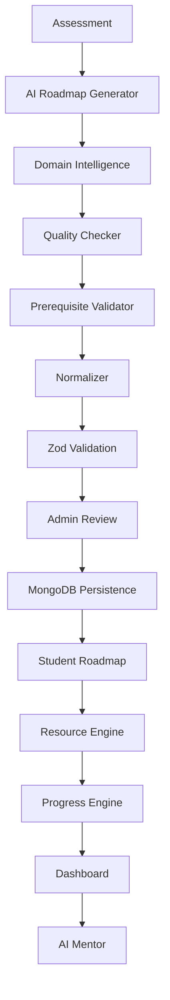
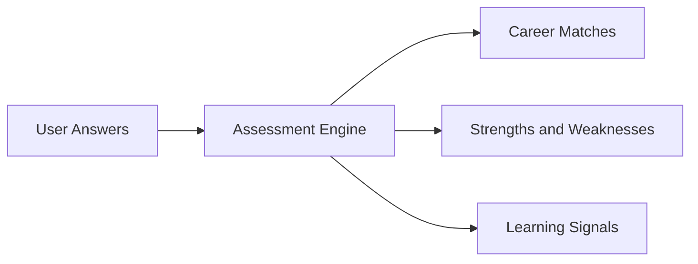
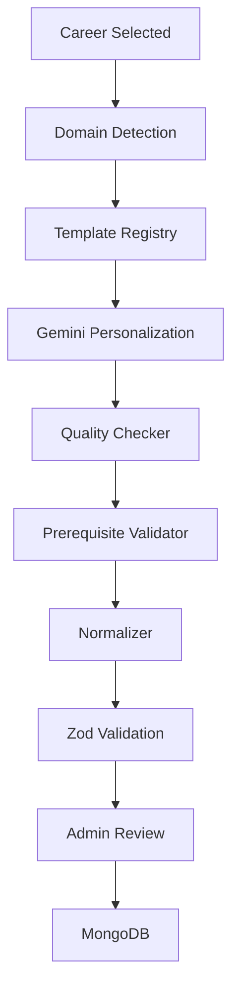
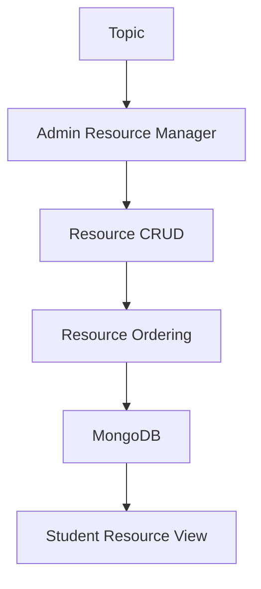
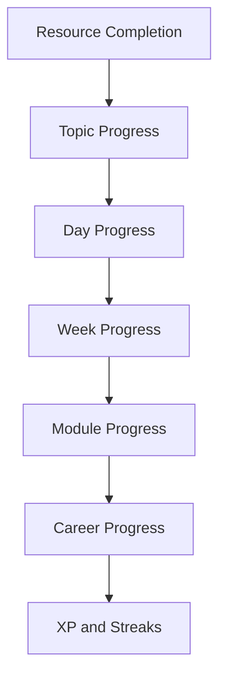

# Pragyan Architecture

## Overview
Pragyan is a layered AI learning platform built around assessment, curriculum generation, validation, review, resources, and learner progress.

## Assessment Flow
Assessment results seed career matching, learning recommendations, and user profile context.

## Roadmap Generation Pipeline
The roadmap generator combines domain detection, templates, and AI personalization. It does not invent curriculum order from scratch.

## Domain Intelligence
The domain layer classifies the selected career into a controlled template family.

- Software Engineering
- AI and Machine Learning
- Cybersecurity
- Cloud Computing
- DevOps
- Data Science
- Mobile Development
- UI/UX
- Blockchain
- Game Development

This layer defines canonical prerequisite sequences and keeps AI output aligned to industry order.

## Quality Checker
The quality layer scores curriculum output and flags structural issues before admin review.

Checks include:
- prerequisite correctness
- duplicate topics
- module completeness
- week completeness
- topic density
- capstone coverage
- career preparation coverage
- interview preparation coverage

## Resource Engine
The resource layer attaches curated learning resources to topics and keeps the system future-ready for AI recommendation.

## Progress Engine
The progress layer tracks learning completion and aggregates progress upward.

## Dashboard
The dashboard exposes career progress, current learning state, next actions, and overall readiness.

Typical dashboard data:
- current module
- current week
- current day
- current topic
- resource completion
- XP
- streaks
- estimated completion
- next recommended topic

## AI Layer
The AI layer is used for personalization, explanation, and later recommendation support.

Current AI usage:
- curriculum personalization
- diagnostics and explanations
- mentor assistance

Future AI usage:
- resource recommendation
- adaptive practice suggestions
- learner-specific mentorship

## Implementation Principle
Deterministic curriculum structure comes first. AI personalizes content, explains decisions, and helps with adaptation, but it does not own the prerequisite graph.
